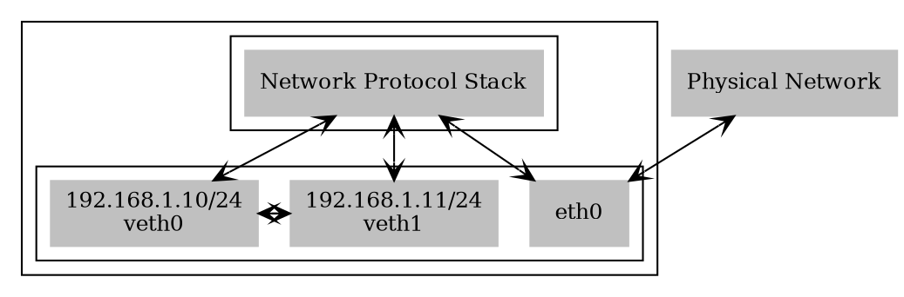
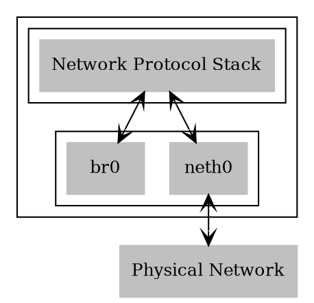
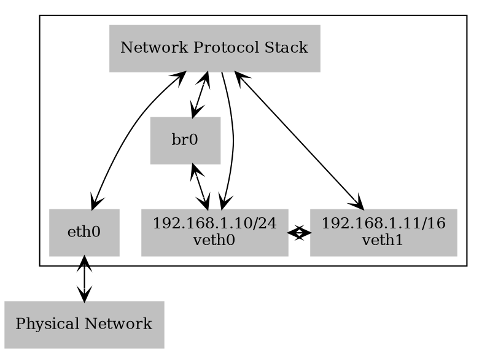
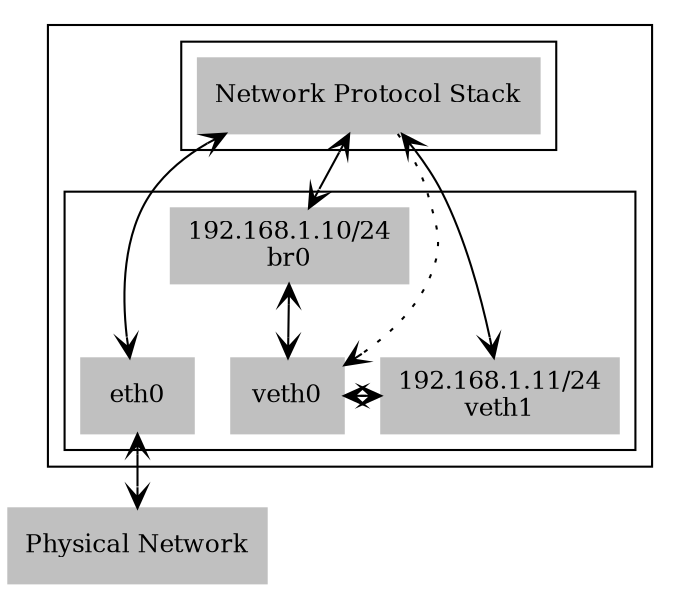
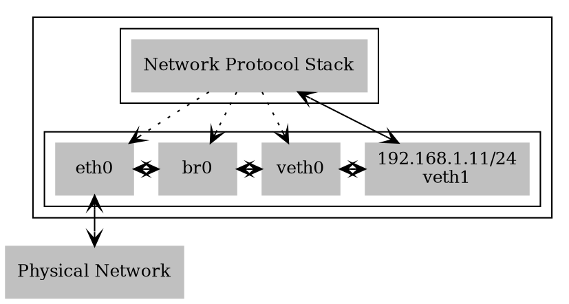

[TOC]
# Linux虚拟网络设备之veth-pair/bridge

> 本文所有的操作都是在docker上进行的，启动容器时注意赋予对应的权限，--privileged

## 什么是veth-pair

顾名思义，`veth-pair`就是一对的虚拟设备接口，它都是成对出现的。一端连着协议栈，一端彼此相连着。

正因为有这个特性，它常常充当着一个桥梁，连接着各种虚拟网络设备，典型的例子像“两个 namespace 之间的连接”，“Bridge、OVS 之间的连接”，“Docker 容器之间的连接” 等等

### veth的特点

- veth和其它的网络设备都一样，一端连接的是内核协议栈。
- veth设备是成对出现的，另一端两个设备彼此相连
- 一个设备收到协议栈的数据发送请求后，会将数据发送到另一个设备上去。

下面先给一张veth的关系图，后续通过实际操作实现veth：



### 示例

创建veth对veth0/veth1，先只给veth0配置IP，给veth1加入ns1，然后将两个设备启动

``` bash
$ ip link add veth0 type veth peer name veth1
$ ip addr add 192.168.1.10/24 dev veth0
$ ip link set veth0 up

$ ip netns add ns1
$ ip link set dev veth1 netns ns1
$ ip netns exec ns1 ip link set veth1 up
```

先ping一下192.168.1.11，由于veth1无ip，所以肯定不通。

``` bash
$ ping -c 4 192.168.1.11
PING 192.168.1.11 (192.168.1.11) 56(84) bytes of data.
From 192.168.1.10 icmp_seq=1 Destination Host Unreachable
From 192.168.1.10 icmp_seq=2 Destination Host Unreachable
From 192.168.1.10 icmp_seq=3 Destination Host Unreachable
From 192.168.1.10 icmp_seq=4 Destination Host Unreachable

--- 192.168.1.11 ping statistics ---
4 packets transmitted, 0 received, +4 errors, 100% packet loss, time 155ms
pipe 4
```

再抓包看看veth0和veth1的情况：

``` bash
$ tcpdump -n -i veth0
tcpdump: verbose output suppressed, use -v or -vv for full protocol decode
listening on veth0, link-type EN10MB (Ethernet), capture size 262144 bytes
03:41:46.312013 ARP, Request who-has 192.168.1.11 tell 192.168.1.10, length 28
03:41:47.384095 ARP, Request who-has 192.168.1.11 tell 192.168.1.10, length 28
03:41:48.427118 ARP, Request who-has 192.168.1.11 tell 192.168.1.10, length 28
03:41:49.464310 ARP, Request who-has 192.168.1.11 tell 192.168.1.10, length 28
03:41:50.505492 ARP, Request who-has 192.168.1.11 tell 192.168.1.10, length 28
03:41:51.545235 ARP, Request who-has 192.168.1.11 tell 192.168.1.10, length 28

$ ip netns exec ns1 bash
$ tcpdump -n -i veth1
tcpdump: verbose output suppressed, use -v or -vv for full protocol decode
listening on veth1, link-type EN10MB (Ethernet), capture size 262144 bytes
03:41:46.312046 ARP, Request who-has 192.168.1.11 tell 192.168.1.10, length 28
03:41:47.384130 ARP, Request who-has 192.168.1.11 tell 192.168.1.10, length 28
03:41:48.427157 ARP, Request who-has 192.168.1.11 tell 192.168.1.10, length 28
03:41:49.464342 ARP, Request who-has 192.168.1.11 tell 192.168.1.10, length 28
03:41:50.505530 ARP, Request who-has 192.168.1.11 tell 192.168.1.10, length 28
03:41:51.545272 ARP, Request who-has 192.168.1.11 tell 192.168.1.10, length 28
```

从上面的输出看出，veth0，veth1收到了同样的arp请求，但是没有arp应答包，之所以会这样，是因为：

- ping进程构造ICMP echo请求包，并通过socket发给协议栈，
协议栈根据目的IP地址和系统路由表，知道去192.168.1.11的数据包应该要由192.168.1.10口出去
- 由于是第一次访问192.168.1.11，且目的IP和本地IP在同一个网段，所以协议栈会先发送ARP出去，询问192.168.1.11的mac地址
- 协议栈将ARP包交给veth0，让它发出去
- 由于veth0的另一端连的是veth1，所以ARP请求包就转发给了veth1
- veth1收到ARP包后，转交给另一端的协议栈
- 协议栈一看自己的设备列表，发现本地没有192.168.1.11这个IP，于是就丢弃了该ARP请求包，这就是为什么只能看到ARP请求包，看不到应答包的原因

现在给veth1配置上IP:192.168.1.11/24

``` bash
$ ip netns exec ns1 ip addr add 192.168.1.11/24 dev veth1
```

然后再ping 192.168.1.11，成功，下面是抓包情况

``` bash
$ ping -c 4 192.168.1.11 -I veth0
PING 192.168.1.11 (192.168.1.11) from 192.168.1.10 veth0: 56(84) bytes of data.
64 bytes from 192.168.1.11: icmp_seq=1 ttl=64 time=0.111 ms
64 bytes from 192.168.1.11: icmp_seq=2 ttl=64 time=0.069 ms
64 bytes from 192.168.1.11: icmp_seq=3 ttl=64 time=0.067 ms
64 bytes from 192.168.1.11: icmp_seq=4 ttl=64 time=0.073 ms

--- 192.168.1.11 ping statistics ---
4 packets transmitted, 4 received, 0% packet loss, time 102ms
rtt min/avg/max/mdev = 0.067/0.080/0.111/0.018 ms


$ tcpdump -n -i veth0
tcpdump: verbose output suppressed, use -v or -vv for full protocol decode
listening on veth0, link-type EN10MB (Ethernet), capture size 262144 bytes
04:42:43.877424 IP 192.168.1.10 > 192.168.1.11: ICMP echo request, id 96, seq 1, length 64
04:42:43.877468 IP 192.168.1.11 > 192.168.1.10: ICMP echo reply, id 96, seq 1, length 64
04:42:44.897628 IP 192.168.1.10 > 192.168.1.11: ICMP echo request, id 96, seq 2, length 64
04:42:44.897688 IP 192.168.1.11 > 192.168.1.10: ICMP echo reply, id 96, seq 2, length 64
04:42:45.937207 IP 192.168.1.10 > 192.168.1.11: ICMP echo request, id 96, seq 3, length 64
04:42:45.937270 IP 192.168.1.11 > 192.168.1.10: ICMP echo reply, id 96, seq 3, length 64
04:42:46.978887 IP 192.168.1.10 > 192.168.1.11: ICMP echo request, id 96, seq 4, length 64
04:42:46.978948 IP 192.168.1.11 > 192.168.1.10: ICMP echo reply, id 96, seq 4, length 64
04:42:48.897838 ARP, Request who-has 192.168.1.11 tell 192.168.1.10, length 28
04:42:48.897886 ARP, Request who-has 192.168.1.10 tell 192.168.1.11, length 28
04:42:48.897895 ARP, Reply 192.168.1.10 is-at 9a:28:dd:bb:a5:c8, length 28
04:42:48.897906 ARP, Reply 192.168.1.11 is-at 5a:14:87:18:10:71, length 28


# network namespace: ns1
$ tcpdump -n -i veth1
tcpdump: verbose output suppressed, use -v or -vv for full protocol decode
listening on veth1, link-type EN10MB (Ethernet), capture size 262144 bytes
04:42:43.877449 IP 192.168.1.10 > 192.168.1.11: ICMP echo request, id 96, seq 1, length 64
04:42:43.877466 IP 192.168.1.11 > 192.168.1.10: ICMP echo reply, id 96, seq 1, length 64
04:42:44.897664 IP 192.168.1.10 > 192.168.1.11: ICMP echo request, id 96, seq 2, length 64
04:42:44.897686 IP 192.168.1.11 > 192.168.1.10: ICMP echo reply, id 96, seq 2, length 64
04:42:45.937246 IP 192.168.1.10 > 192.168.1.11: ICMP echo request, id 96, seq 3, length 64
04:42:45.937268 IP 192.168.1.11 > 192.168.1.10: ICMP echo reply, id 96, seq 3, length 64
04:42:46.978924 IP 192.168.1.10 > 192.168.1.11: ICMP echo request, id 96, seq 4, length 64
04:42:46.978947 IP 192.168.1.11 > 192.168.1.10: ICMP echo reply, id 96, seq 4, length 64
04:42:48.897796 ARP, Request who-has 192.168.1.10 tell 192.168.1.11, length 28
04:42:48.897897 ARP, Request who-has 192.168.1.11 tell 192.168.1.10, length 28
04:42:48.897902 ARP, Reply 192.168.1.11 is-at 5a:14:87:18:10:71, length 28
04:42:48.897903 ARP, Reply 192.168.1.10 is-at 9a:28:dd:bb:a5:c8, length 28
```

接着上面的配置，下面开始bridge

## 什么是bridge

首先，bridge是一个虚拟网络设备，所以具有网络设备的特征，可以配置IP、MAC地址等；其次，bridge是一个虚拟交换机，和物理交换机有类似的功能。

对于普通的网络设备来说，只有两端，从一端进来的数据会从另一端出去，如物理网卡从外面网络中收到的数据会转发给内核协议栈，而从协议栈过来的数据会转发到外面的物理网络中。

而bridge不同，bridge有多个端口，数据可以从任何端口进来，进来之后从哪个口出去和物理交换机的原理差不多，要看mac地址。

### 创建bridge

先用iproute2工具创建一个网桥：

```bash
# 创建网桥
ip link add name br0 type bridge 
# 启用网桥
ip link set br0 up 
```

当刚创建一个bridge时，它是一个独立的网络设备，只有一个端口连着协议栈，其它的端口啥都没连，这样的bridge没有任何实际功能，如下图所示：



### 创建veth设备，与bridge设备相连

veth是成对创建，创建后配置IP。_(详见本文veth部分)_

``` bash
# 将eth0连接br0
$ ip link set dev veth0 master br0
# 通过bridge link命令可以看到br0上连接了哪些设备
$ bridge link
6: veth0@veth1: <BROADCAST,MULTICAST,UP,LOWER_UP> mtu 1500 master br0 state forwarding priority 32 cost 2
```

此时，网络拓扑图如下：



br0和veth0连接后，有如下变化：

- br0，veth0联通，并且是双向通道
- 协议栈和veth0变成了单通道，协议栈能传输数据给veth0，但veth0从外部转发的数据不会给协议栈
- br0的mac地址变成了veth0的mac地址

下面验证一下上述所说的数据流向是否正确：

通过veth0 ping veth1，(失败)：

``` bash
$ ping -c 1 192.168.1.11 -I veth0
PING 192.168.1.11 (192.168.1.11) from 192.168.1.10 veth0: 56(84) bytes of data.

--- 192.168.1.11 ping statistics ---
1 packets transmitted, 0 received, 100% packet loss, time 0ms
```

为什么veht0加入bridge后，就ping不通veht1呢？通过tcpdump抓包分析下：
_PS: debian系列可以通过命令：apt-get install tcpdump 安装_

``` bash
$ tcpdump -n -i veth0
tcpdump: verbose output suppressed, use -v or -vv for full protocol decode
listening on veth0, link-type EN10MB (Ethernet), capture size 262144 bytes
06:33:19.468165 ARP, Request who-has 192.168.1.11 tell 192.168.1.10, length 28
06:33:19.468219 ARP, Reply 192.168.1.11 is-at 5a:14:87:18:10:71, length 28
06:33:20.513989 ARP, Request who-has 192.168.1.11 tell 192.168.1.10, length 28
06:33:20.514109 ARP, Reply 192.168.1.11 is-at 5a:14:87:18:10:71, length 28
06:33:21.532741 ARP, Request who-has 192.168.1.11 tell 192.168.1.10, length 28
06:33:21.533132 ARP, Reply 192.168.1.11 is-at 5a:14:87:18:10:71, length 28

$ ip netns exec ns1 tcpdump -n -i veth1
tcpdump: verbose output suppressed, use -v or -vv for full protocol decode
listening on veth1, link-type EN10MB (Ethernet), capture size 262144 bytes
06:33:19.468190 ARP, Request who-has 192.168.1.11 tell 192.168.1.10, length 28
06:33:19.468217 ARP, Reply 192.168.1.11 is-at 5a:14:87:18:10:71, length 28
06:33:20.514023 ARP, Request who-has 192.168.1.11 tell 192.168.1.10, length 28
06:33:20.514108 ARP, Reply 192.168.1.11 is-at 5a:14:87:18:10:71, length 28
06:33:21.532782 ARP, Request who-has 192.168.1.11 tell 192.168.1.10, length 28
06:33:21.533129 ARP, Reply 192.168.1.11 is-at 5a:14:87:18:10:71, length 28

$ tcpdump -n -i br0
tcpdump: verbose output suppressed, use -v or -vv for full protocol decode
listening on br0, link-type EN10MB (Ethernet), capture size 262144 bytes
06:33:19.468227 ARP, Reply 192.168.1.11 is-at 5a:14:87:18:10:71, length 28
06:33:20.514109 ARP, Reply 192.168.1.11 is-at 5a:14:87:18:10:71, length 28
06:33:21.533132 ARP, Reply 192.168.1.11 is-at 5a:14:87:18:10:71, length 28
```

通过tcpdump可以看出，由于veth0的arp缓存里没有veth1的mac地址，所以ping之前先发送arp请求。抓包数据显示，veth0发出了arp请求，收到了返回，veth1收到了arp请求，也响应了arp请求，但是br0上只发现了应答数据。总体请求响应的流程没有问题，问题出在veth0收到应答包之后，没有给协议栈，而是给了br0，协议栈得不到veth1的mac地址，所以通讯失败。

### 给bridge配置IP

通过上面的分析发现，给`veth0`分配IP无意义，即使协议栈给`veth0`传数据，也收不到响应，所以我们把`veth0`的IP地址转让给bridge(`br0`)。

``` bash
$ ip addr del 192.168.1.10/24 dev veth0
$ ip addr add 192.168.1.10/24 dev br0
```

分配之后如图所示：



> `veth0`没有配置IP，协议栈就不会将数据包发给`veth0`，即使强制要求数据包通过`veth0`发送出去，响应的数据也只能最终给到`br0`，协议栈是无法收到应答包的。但协议栈还是和`veth0`之间有联系，所以图中用虚线表示。最终，可以简单认为`veth0`就是一根网线。

通过`br0`ping`veth1`，成功：

``` bash
$ ping -c 1 192.168.1.11 -I br0  
PING 192.168.1.11 (192.168.1.11) from 192.168.1.10 br0: 56(84) bytes of data.
64 bytes from 192.168.1.11: icmp_seq=1 ttl=64 time=0.144 ms

--- 192.168.1.11 ping statistics ---
1 packets transmitted, 1 received, 0% packet loss, time 0ms
rtt min/avg/max/mdev = 0.144/0.144/0.144/0.000 ms

$ tcpdump -n -i veth0
tcpdump: verbose output suppressed, use -v or -vv for full protocol decode
listening on veth0, link-type EN10MB (Ethernet), capture size 262144 bytes
06:43:01.624722 IP 192.168.1.10 > 192.168.1.11: ICMP echo request, id 134, seq 1, length 64
06:43:01.624769 IP 192.168.1.11 > 192.168.1.10: ICMP echo reply, id 134, seq 1, length 64
06:43:06.627103 ARP, Request who-has 192.168.1.11 tell 192.168.1.10, length 28
06:43:06.627121 ARP, Request who-has 192.168.1.10 tell 192.168.1.11, length 28
06:43:06.627137 ARP, Reply 192.168.1.10 is-at 9a:28:dd:bb:a5:c8, length 28
06:43:06.627148 ARP, Reply 192.168.1.11 is-at 5a:14:87:18:10:71, length 28

$ ip netns exec ns1 tcpdump -n -i veth1
tcpdump: verbose output suppressed, use -v or -vv for full protocol decode
listening on veth1, link-type EN10MB (Ethernet), capture size 262144 bytes
06:43:01.624747 IP 192.168.1.10 > 192.168.1.11: ICMP echo request, id 134, seq 1, length 64
06:43:01.624767 IP 192.168.1.11 > 192.168.1.10: ICMP echo reply, id 134, seq 1, length 64
06:43:06.627041 ARP, Request who-has 192.168.1.10 tell 192.168.1.11, length 28
06:43:06.627140 ARP, Request who-has 192.168.1.11 tell 192.168.1.10, length 28
06:43:06.627143 ARP, Reply 192.168.1.11 is-at 5a:14:87:18:10:71, length 28
06:43:06.627145 ARP, Reply 192.168.1.10 is-at 9a:28:dd:bb:a5:c8, length 28

$ tcpdump -n -i br0
tcpdump: verbose output suppressed, use -v or -vv for full protocol decode
listening on br0, link-type EN10MB (Ethernet), capture size 262144 bytes
06:43:01.624681 IP 192.168.1.10 > 192.168.1.11: ICMP echo request, id 134, seq 1, length 64
06:43:01.624775 IP 192.168.1.11 > 192.168.1.10: ICMP echo reply, id 134, seq 1, length 64
06:43:06.627091 ARP, Request who-has 192.168.1.11 tell 192.168.1.10, length 28
06:43:06.627128 ARP, Request who-has 192.168.1.10 tell 192.168.1.11, length 28
06:43:06.627135 ARP, Reply 192.168.1.10 is-at 9a:28:dd:bb:a5:c8, length 28
06:43:06.627150 ARP, Reply 192.168.1.11 is-at 5a:14:87:18:10:71, length 28
```

### bridge必须要配置IP吗

在我们常见的物理交换机中，有可以配置IP和不能配置IP两种，不能配置IP的交换机一般通过com口连上去做配置（更简单的交换机连com口的没有，不支持任何配置），而能配置IP的交换机可以在配置好IP之后，通过该IP远程连接上去做配置，从而更方便。

bridge就属于后一种交换机，自带虚拟网卡，可以配置IP，该虚拟网卡一端连在bridge上，另一端跟协议栈相连。和物理交换机一样，bridge的工作不依赖于该虚拟网卡，但bridge工作不代表机器能连上网，要看组网方式。

如果我们把物理网卡加入`br0`，删除`br0`的IP，则网络结构如下：



 > 上面如果没有veth0和veth1的话，删除br0上的IP后，网络将会不通，因为没有设备和协议栈完全相连

 ### bridge常用场景

 上面通过例子展示了bridge的功能，但例子中的那种部署方式没有什么实际用途，还不如在一个网卡上配置多个IP地址来的直接。这里来介绍两种常见的部署方式。

 #### 虚拟机

 虚拟机通过tun/tap或者其它类似的虚拟网络设备，将虚拟机内的网卡同br0连接起来，这样就达到和真实交换机一样的效果，虚拟机发出去的数据包先到达br0，然后由br0交给eth0发送出去，数据包都不需要经过host机器的协议栈，效率高。

 #### docker

 由于容器运行在自己单独的network namespace里面，所以都有自己单独的协议栈，情况和上面的虚拟机差不多，但它采用了另一种方式来和外界通信：

 ``` dot
digraph G {
    rankdir="LR";

    subgraph cluster_host {
        label = "HOST"
        nps [fontsize=12, shape=polygon, sides=4, color="grey",   style=filled, label="Network Protocol Stack"]

        eth0 [fontsize=12, shape=polygon, sides=4, color="grey",   style=filled, label=".3.101\neth0"]

        br0 [fontsize=12, shape=polygon, sides=4, color="grey",   style=filled, label=".9.1\nbr0"]

        veth_1 [fontsize=12, shape=polygon, sides=4, color="grey",   style=filled, label="veth"]

        veth_2 [fontsize=12, shape=polygon, sides=4, color="grey",   style=filled, label="veth"]

        nps -> eth0[arrowhead=vee, arrowtail=vee, dir=both]
        nps -> br0[arrowhead=vee, arrowtail=vee, dir=both]
        veth_1 -> br0[arrowhead=vee, arrowtail=vee, dir=both]
        veth_2 -> br0[arrowhead=vee, arrowtail=vee, dir=both]
    }

    pn [fontsize=12, shape=polygon, sides=4, color="grey",   style=filled, label=".3.0/24\nPhysical Network"]

    pn -> eth0[arrowhead=vee, arrowtail=vee, dir=both]

    subgraph cluster_c1 {
        label = "Container 1"

        nps1 [fontsize=12, shape=polygon, sides=4, color="grey",   style=filled, label="Network Protocol Stack"]

        eth01 [fontsize=12, shape=polygon, sides=4, color="grey",   style=filled, label=".9.2\neth0"]

        nps1 -> eth01[arrowhead=vee, arrowtail=vee, dir=both]
    }

    subgraph cluster_c2 {
        label = "Container 2"

        nps2 [fontsize=12, shape=polygon, sides=4, color="grey",   style=filled, label="Network Protocol Stack"]

        eth02 [fontsize=12, shape=polygon, sides=4, color="grey",   style=filled, label=".9.3\neth0"]

        nps2 -> eth02[arrowhead=vee, arrowtail=vee, dir=both]
    }

    veth_1 -> eth01[arrowhead=vee, arrowtail=vee, dir=both]
    veth_2 -> eth02[arrowhead=vee, arrowtail=vee, dir=both]
}
 ```

 容器中配置网关为.9.1，发出去的数据包先到达br0，然后交给host机器的协议栈，由于目的IP是外网IP，且host机器开启了IP forward功能，于是数据包会通过eth0发送出去，由于.9.1是内网IP，所以一般发出去之前会先做NAT转换（NAT转换和IP forward功能都需要自己配置）。由于要经过host机器的协议栈，并且还要做NAT转换，所以性能没有上面虚拟机那种方案好，优点是容器处于内网中，安全性相对要高点。（由于数据包统一由IP层从eth0转发出去，所以不存在mac地址的问题，在无线网络环境下也工作良好）